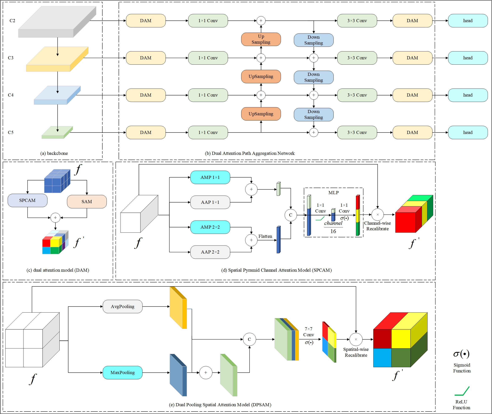

# PDPA-PAN

This is the official repository for “Large-Scale High Altitude UAV-based Vehicle Detection via Pyramid Dual Pooling Attention Path Aggregation Network”. The repo is based on [JDet](https://github.com/Jittor/JDet).

## Abstract

UAVs can collect vehicle data in high altitude scenes, playing a significant role in intelligent urban management due to their wide of view. Nevertheless, the current datasets for UAV-based vehicle detection are acquired at altitude below 150 meters. This contrasts with the data perspective obtained from high altitude scenes, potentially leading to incongruities in data distribution. Consequently, it is challenging to apply these datasets effectively in high altitude scenes, and there is an ongoing obstacle. To resolve this challenge, we developed a comprehensive high altitude dataset named LH-UAV-Vehicle, specifically collected at flight altitudes ranging from 250 to 400 meters. Collecting data at higher flight altitudes offers a broader perspective, but it concurrently introduces complexity and diversity in the background, which consequently impacts vehicle localization and recognition accuracy. In response, we proposed the pyramid dual pooling attention path aggregation network (PDPA-PAN), an innovative framework that improves detection performance in high altitude scenes by combining spatial and semantic information from distinct feature layers. Object attention integration in both spatial and channel dimensions is aimed by the pyramid dual pooling attention module (PDPAM), which is achieved through the parallel integration of two distinct attention mechanisms. Furthermore, we have individually developed the pyramid pooling attention module (PPAM) and the dual pooling attention module (DPAM). The PPAM emphasizes channel attention, while the DPAM prioritizes spatial attention. This design aims to enhance vehicle information and suppress background interference more effectively. Extensive experiments conducted on the LH-UAV-Vehicle dataset conclusively demonstrate the efficacy of the proposed vehicle detection method.



## Requirements
- Ubuntu 18.04
- Python 3.7
- clang >= 8.0
- g++ >= 5.4.0

## Installation

Please refer to [JDet](https://github.com/Jittor/JDet) for installation and data preprocessing.

## Getting Started

### Train with a single GPU. 
```shell
python tools/run_net.py --config-file=configs/UAV/oriented-finish.py --task=train
```

### Test
```shell
python tools/run_net.py --config-file=configs/UAV/oriented-finish.py --task=test
```

### Evaluation

We use [DOTA_devkit](https://github.com/CAPTAIN-WHU/DOTA_devkit) to evaluate our model.

## LH-UAV-Vehicle

LH-UAV-Vehicle dataset is available. [GoogleDrive](https://drive.google.com/file/d/1499SYQm1WklKdF1vGfVa6zQN-m_zId_N/view?usp=drive_link)


## Citation

Please cite this if you want to use it in your work.

```
@ARTICLE{jackychou,
  title={Large-Scale High Altitude UAV-based Vehicle Detection via Pyramid Dual Pooling Attention Path Aggregation Network}, 
  author={Ying, Zilu, and Zhou, Jianhong, and Zhai, Yikui Jianhong Zhou, Yikui Zhai and Quan, Hao and Li, Wenba and Genovese, Angelo and Piuri, Vincenzo and Fabio, Scotti},
  journal={}, 
  year={},
  volume={},
  number={},
  pages={},
  doi={}
}
```
